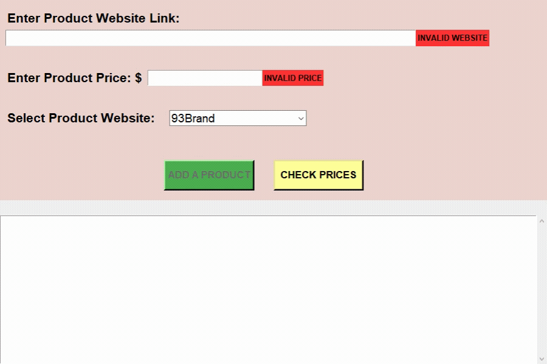
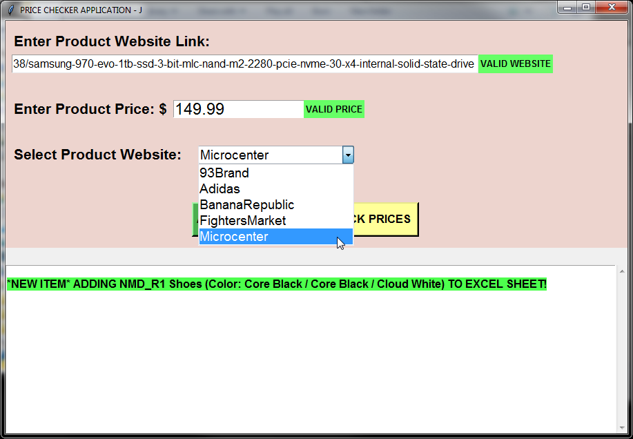
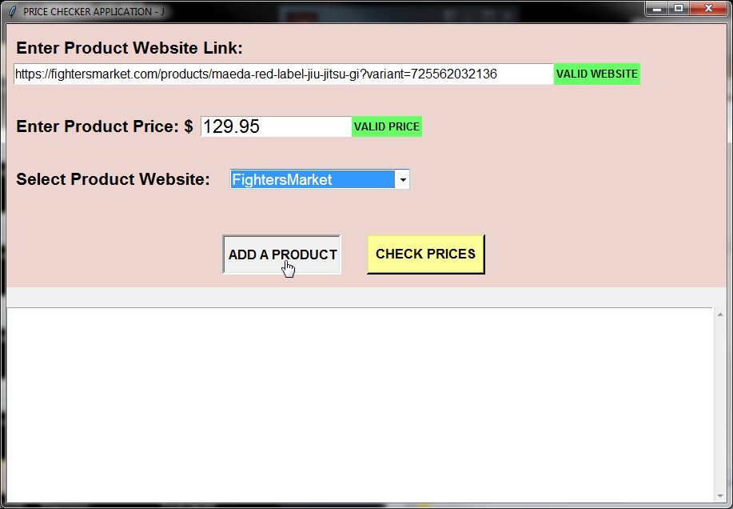
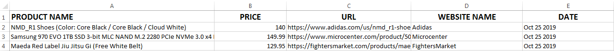
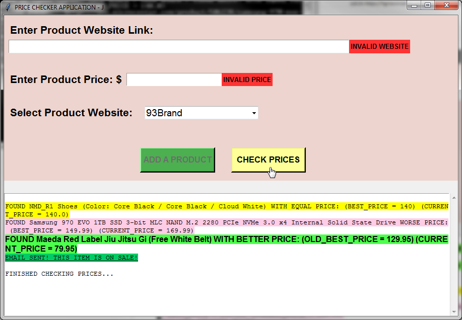
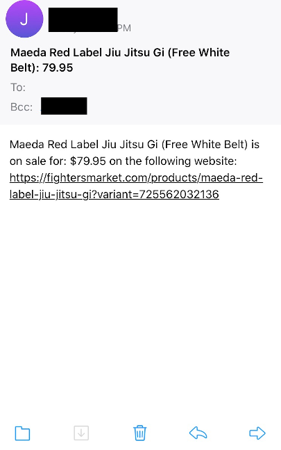
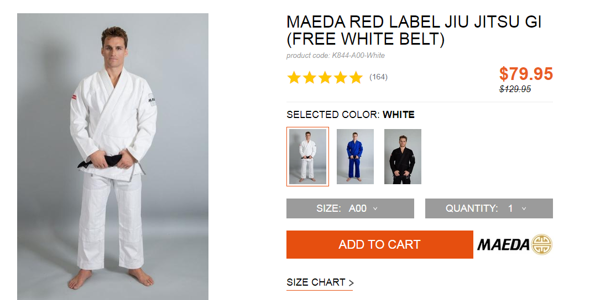
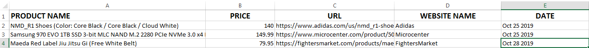

# PriceChecker
PriceChecker is a Python application that checks for a discount on any product that the user has added to an Excel spreadsheet using HTML parsing. When there is a discount, the user is notified via email about the discounted item and its new price. The discounted price is automatically updated to the Excel spreadsheet so that it becomes the new best price for future comparisons.

Currently the following websites that are supported are: 
* 93Brand (https://93brand.com/)
* Adidas (https://www.adidas.com/us)
* BananaRepublic (https://bananarepublic.gap.com/)
* FightersMarket (https://fightersmarket.com/)
* Microcenter (https://www.microcenter.com/)


## Installation

Use the package manager [pip](https://pip.pypa.io/en/stable/) to install the following:

```bash
pip install beautifulsoup4
pip install lxml
pip install requests
pip install tldextract
pip install openpyxl

```


## Usage

Edit the **_PriceChecker.py_** file to configure the program to send a notification to the appropriate email.

```python
def SendEmail(FROM, TO, SUBJECT, TEXT):
    smtpObj = smtplib.SMTP_SSL('smtp.gmail.com', 465)  # Edit if you will be using a different email service
```

```python
sender_emailUsername = 'tom@example.com'  #  The email address that will send the notification email
sender_emailPassword = 'password123'
receiver_emailUsername = 'will@example.com'  # The email address that will receieve the notification email
```


## Demo

 <br/>
### Let's add some more items.
##### Adding an item from Microcenter:
 <br/> 

##### Adding an item from FightersMarket:


### After adding our items... our Excel sheet looks like this: 


### Let's check if there's a deal for any of these items:


### Looks like there's a sale!
##### Email Notification:
 <br/> <br/>

##### Let's check the website:

<br/><br/>

##### Sale Confirmed! And our Excel sheet is updated:

